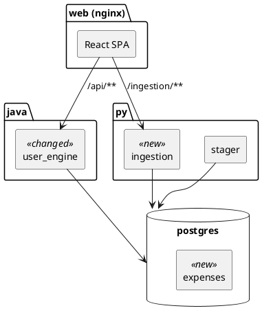
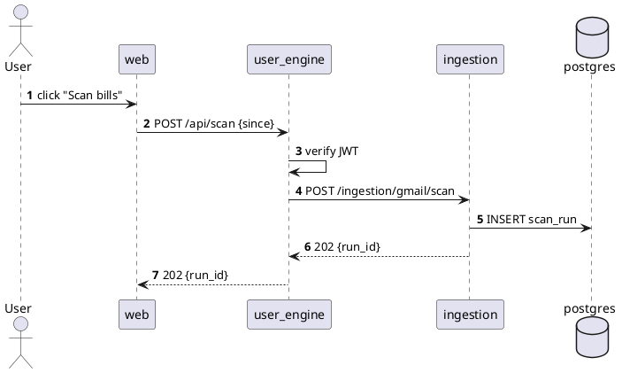
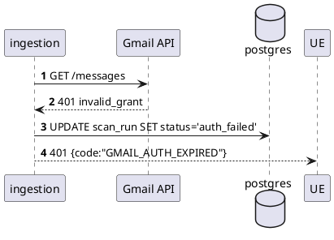

# Spec: <Feature name>

| Field       | Value                                                    |
|-------------|----------------------------------------------------------|
| Feature     | <one line>                                               |
| Engine(s)   | `py/ingestion`, `java/user_engine`, `web`, ...           |
| Owner       | <name>                                                   |
| Status      | draft / in-review / accepted / implemented               |
| Date        | YYYY-MM-DD                                               |
| jlog day    | Day N (`resources/jlog/app_development_log.md`)          |
| Related     | <spec / issue / PR links>                                |

## 1. Motivation

<Max 3 sentences. Why this change now, what breaks without it.>

## 2. Scope

| In                                                | Out                                          |
|---------------------------------------------------|----------------------------------------------|
| <capability 1>                                    | <deliberate non-goal 1>                      |
| <capability 2>                                    | <deferred to future spec>                    |

## 3. Architecture change

Legend: `<<new>>` added by this spec, `<<changed>>` altered, `<<removed>>` deleted.

## 4. Workflows

### 4.1 <Happy path — one-line name>

### 4.2 <Failure path — e.g. token expired>

## 5. API contracts

### 5.1 `POST /api/scan` — `user_engine`

| Field           | Value                                                       |
|-----------------|-------------------------------------------------------------|
| Auth            | Bearer JWT (issued by `user_engine`)                        |
| Request DTO     | `ScanRequest { since: Instant, sources: List<Source> }`    |
| Validation      | `@NotNull since`, `@Size(min=1) sources`                    |
| Response DTO    | `ScanResponse { runId: UUID, acceptedAt: Instant }`         |
| Success         | `202 Accepted`                                              |
| Failure         | `400` invalid body · `401` no/expired JWT · `502` upstream  |

### 5.2 `POST /ingestion/gmail/scan` — `py/ingestion`

| Field         | Value                                                     |
|---------------|-----------------------------------------------------------|
| Auth          | Internal — service token in `X-Internal-Auth` header      |
| Request model | `pydantic.GmailScanIn { since: datetime }`                |
| Response      | `GmailScanOut { run_id: UUID }`                           |
| Status codes  | `202` accepted · `401` bad internal token · `503` Gmail down |

## 6. Database schema

### 6.1 `expenses` (new)

| Column        | Type          | Constraints                          | Notes                        |
|---------------|---------------|--------------------------------------|------------------------------|
| id            | `UUID`        | PK, default `gen_random_uuid()`      |                              |
| user_id       | `UUID`        | FK → `users(id)`, NOT NULL           | idx `expenses_user_idx`      |
| amount_minor  | `BIGINT`      | NOT NULL                             | integer cents                |
| currency      | `CHAR(3)`    | NOT NULL, default `'INR'`            | ISO 4217                     |
| occurred_at   | `TIMESTAMPTZ` | NOT NULL                             | idx `expenses_time_idx`      |
| source        | `TEXT`        | NOT NULL, CHECK IN (`gmail`,`manual`)|                              |
| raw_ref       | `TEXT`        |                                      | pointer to blob in stager    |

### 6.2 Migrations

| File                                              | Applied by       |
|---------------------------------------------------|------------------|
| `infra/postgres/init/02_expenses.sql`             | postgres init    |
| `java/user_engine/src/main/resources/db/V2__...`  | Flyway (when in) |

## 7. Exception handling

| Trigger                                | Type / Error code           | HTTP | User message                   | Log level |
|----------------------------------------|-----------------------------|------|--------------------------------|-----------|
| JWT missing / expired                  | `AuthTokenException`        | 401  | "Please sign in again."        | INFO      |
| Gmail returns 401                      | `GmailAuthExpired`          | 401  | "Re-connect Gmail."            | WARN      |
| Gmail 5xx / timeout                    | `UpstreamUnavailable`       | 502  | "Try again in a minute."       | ERROR     |
| DB unique violation on `raw_ref`       | `DuplicateExpense`          | 409  | "Already recorded."            | INFO      |
| Validation failure                     | `MethodArgumentNotValidExc` | 400  | field-level errors             | INFO      |

## 8. Deployment strategy

| Aspect               | Detail                                                                                     |
|----------------------|--------------------------------------------------------------------------------------------|
| Compose services     | `ingestion` (rebuilt), `user_engine` (rebuilt), `postgres` (init SQL added)                |
| Build order          | `cd java && ./gradlew :user_engine:bootJar` → `docker compose -f infra/docker-compose.yml up --build` |
| New env vars         | `GMAIL_INTERNAL_TOKEN` (both `ingestion` and `user_engine`)                                |
| Postgres data reset  | Required — init drop-dir only reruns on empty volume. `docker volume rm kharchakhata_kk-pg-data`. |
| Rollback             | `docker compose down && git revert <sha> && docker compose up --build`                     |
| Feature flag         | `APP_GMAIL_SCAN_ENABLED` on `user_engine` (default false)                                  |

### 8.1 `docker-compose.yml` diff (only if services added/removed)

| Change | Service     | Notes                                          |
|--------|-------------|------------------------------------------------|
| +      | `ocr_worker`| Python image, port 8083, needs GOOGLE_CREDS    |

## 9. Test plan

| Layer            | Scope                                             | Tooling                       |
|------------------|---------------------------------------------------|-------------------------------|
| Unit — java      | `ScanService`, DTO validation                     | JUnit 5 + AssertJ + Mockito   |
| Unit — py        | `GmailScanner.parse_message`                      | pytest                        |
| Integration — java | `user_engine` ↔ postgres                        | Testcontainers postgresql     |
| Integration — py | `ingestion` ↔ postgres ↔ Gmail (recorded fixtures)| pytest + `httpx` MockTransport|
| E2E              | `POST /api/scan` end-to-end via compose stack     | manual, checklist below       |

## 10. Open questions

| # | Question                                          | Owner  | Decision by |
|---|---------------------------------------------------|--------|-------------|
| 1 | Do we deduplicate on `Message-Id` or content hash?| tb     | 2026-08-01  |
| 2 | Retention period for `stager` raw blobs?          | tb     | 2026-08-05  |
