# Spec: `auth_engine` — endpoints

| Field       | Value                                                                                                    |
|-------------|----------------------------------------------------------------------------------------------------------|
| Feature     | Auth authority — Google OAuth login, RS256 session JWT issuance + JWKS broadcast, Google token lifecycle |
| Engine      | `java/auth_engine` (new — supersedes and renames the earlier `login_engine` / `user_engine` scaffold)    |
| Owner       | tb                                                                                                       |
| Status      | draft                                                                                                    |
| Date        | 2026-07-25                                                                                               |
| jlog day    | Day 2 (`resources/jlog/app_development_log.md`)                                                          |
| Related     | Design brief `resources/design/user_login/user_login_index.md`; sibling web-ui spec `2026-07-25-user-login-web-ui.md`; supersedes `2026-07-25-user-login-engine.md` |

## 1. Motivation

`auth_engine` is the single source of truth for "who is this user and can they be trusted right now." It owns Google OAuth, session JWT issuance (RS256 keypair), Google-token refresh, and public-key broadcast. It does not store user profile — that responsibility moves to a separate `user_engine` (out of scope here). Every other engine in the stack verifies JWTs locally against `auth_engine`'s published public key; only Gmail-touching engines call back into `auth_engine` for a fresh Google access_token.

## 2. Responsibilities

| In scope                                                                                | Out of scope                                                             |
|-----------------------------------------------------------------------------------------|--------------------------------------------------------------------------|
| Build Google authorization URL + state cookie                                           | User profile CRUD (owned by `user_engine`)                               |
| Handle Google callback, exchange `code` for tokens                                      | Business logic (expenses, ingestion, staging)                            |
| Parse Google `id_token` payload (no signature check) + enforce `email_verified`         | Multi-provider auth (Apple, Microsoft)                                   |
| Hand identity off to `user_engine` via internal API                                    | Session-JWT refresh endpoint (Pattern A on Day 1 — full re-login)        |
| Persist Google `access_token` + `refresh_token` in `login_tokens` (keyed by Google `sub`) | User profile storage — `khata_users` lives in `user_engine`             |
| Mint session JWTs (RS256, 24h `exp`, thick claims: `sub`, `email`, `name`, `picture`)  | RBAC / permission model                                                  |
| Broadcast public key(s) via `GET /.well-known/jwks.json`                                | Session denylist / server-side revocation (accept 24h damage window)     |
| Internal API: return valid Google access_token to sub-engines (auto-refresh if expired) | Rate limiting on internal APIs (add when first abused)                   |
| Internal API: invalidate a Google access_token after `invalid_grant`                    | JWT verification by sub-engines — done locally via shared verifier lib   |
| Logout — clear cookies                                                                  | Automated key rotation — manual for Day 1                                |

## 3. Architecture

Legend: `<<new>>` added by this spec.

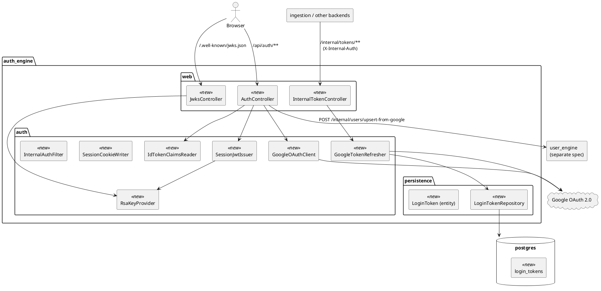

## 4. Workflows

One sequence diagram per endpoint, plus cross-cutting flows (JWT expiry recovery, key rotation) that span multiple endpoints.

### 4.1 `GET /api/auth/google/start` — Redirect to Google

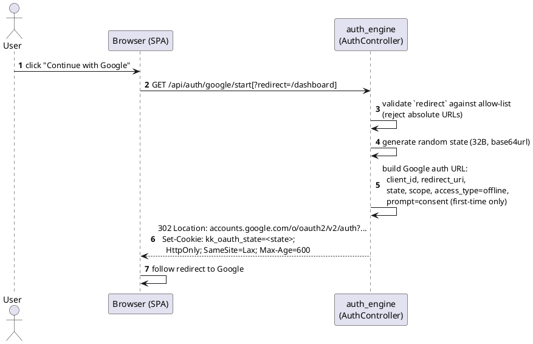

**What it does.** Kick-off point for OAuth. SPA calls this via a plain link/navigation (not fetch — we need the browser to follow the 302). `auth_engine` builds the Google authorization URL, embedding a fresh cryptographically random `state` value that also gets set as a short-lived (10 min) HttpOnly cookie. The cookie-vs-URL match at callback time is our CSRF protection. Nothing is persisted server-side; this endpoint is stateless.

### 4.2 `GET /api/auth/google/callback` — Happy path

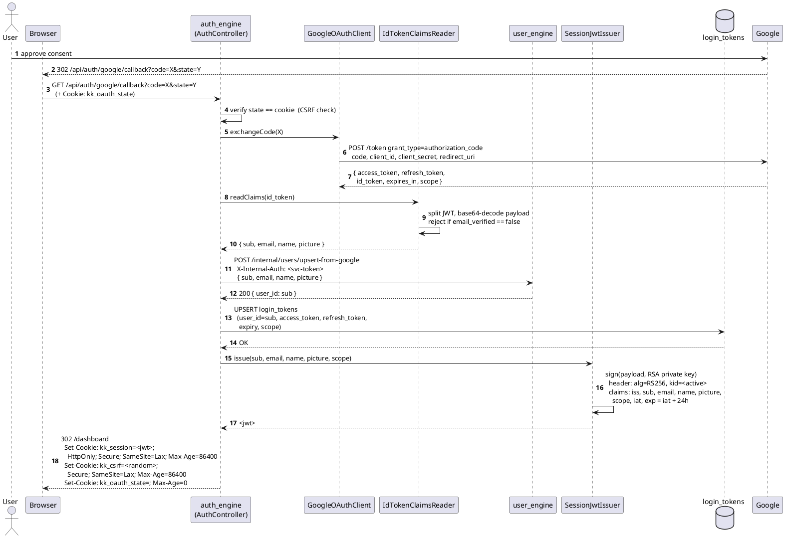

**What it does.** Google redirects the browser here after consent, carrying the OAuth `code`. Eight steps: (1) CSRF check via state-cookie match; (2) exchange `code` for tokens at Google `/token`; (3) `IdTokenClaimsReader` base64-decodes the id_token payload — no signature check because the id_token came back-channel from Google over TLS, and enforces `email_verified==true`; (4) hand identity to `user_engine` via internal API to create/update `khata_users`; (5) persist Google tokens locally in `login_tokens`; (6) mint the RS256 session JWT with thick claims; (7) set the session cookie plus a companion CSRF cookie for future POSTs; (8) clear the state cookie and redirect to `/dashboard`. Only auth_engine ever touches Google tokens — user_engine sees only identity fields.

### 4.3 `GET /api/auth/google/callback` — Failure paths

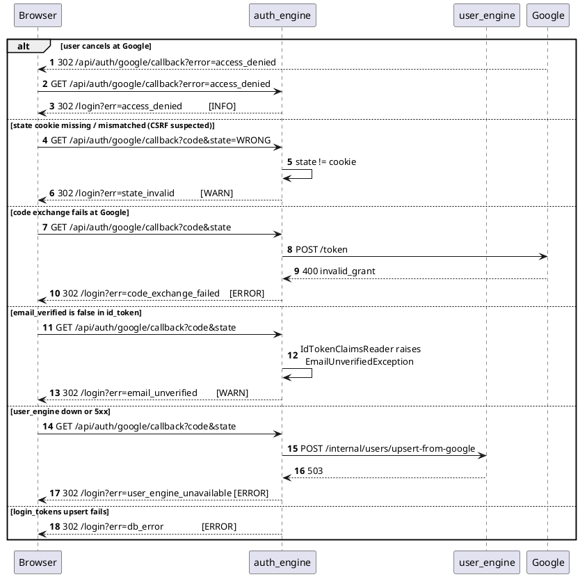

**What it does.** Every failure mode terminates with a `302 /login?err=<code>` — no raw 5xx surfaces to the browser. Log levels calibrated by intent: INFO for user cancellation, WARN for user or CSRF issues, ERROR for upstream/infra failures. The SPA reads `?err` on `/login` and shows an appropriate banner. Note: **no partial state.** If `user_engine` upsert succeeds but `login_tokens` write fails, the user record exists but has no Google tokens — the next login will re-upsert idempotently and re-populate tokens. No 2PC needed.

### 4.4 `POST /api/auth/logout`

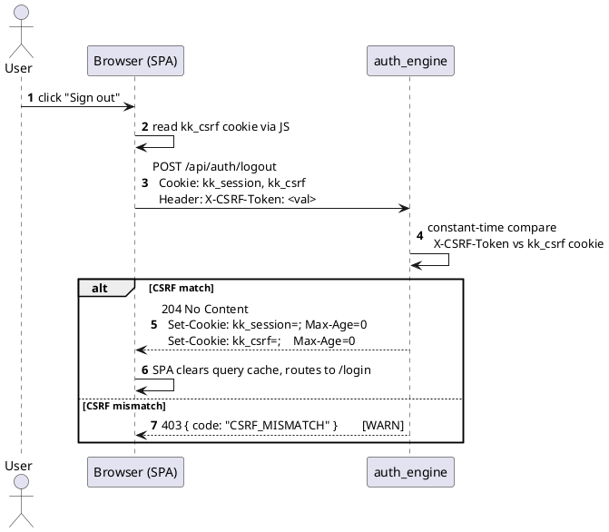

**What it does.** Idempotent client-side sign-out. Double-submit CSRF: the SPA reads the non-HttpOnly `kk_csrf` cookie and echoes it back as an `X-CSRF-Token` header; auth_engine confirms both halves match. No DB touched — session JWT is stateless, so "logout" is just clearing the browser's cookie jar. Google refresh_token in `login_tokens` is deliberately preserved so the next login on this browser reuses it silently (matches user expectation of "I logged out, not disconnected Gmail").

### 4.5 `GET /.well-known/jwks.json` + sub-engine cache

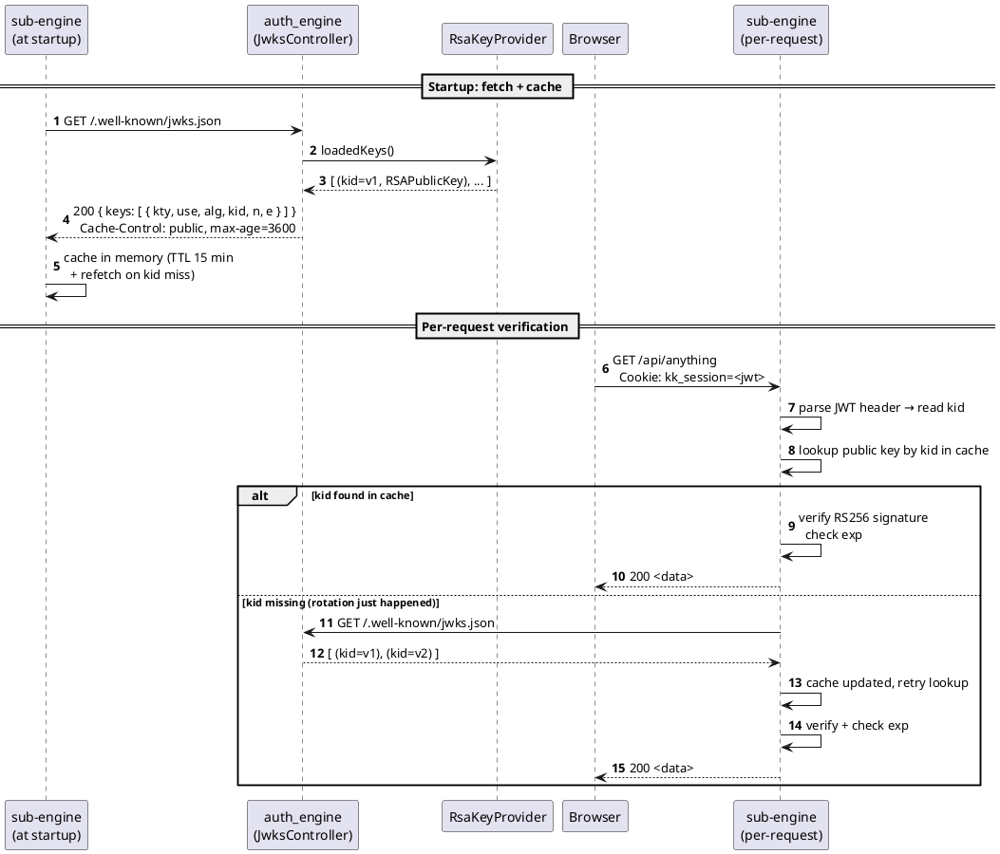

**What it does.** Every sub-engine (user_engine, ingestion, future ones) fetches the JWKS at startup and caches it in-memory. Every incoming JWT is verified purely locally — no round-trip to auth_engine — using the public key whose `kid` matches the JWT header. Two refresh triggers: time-based (every ~15 min) and on-demand when a JWT arrives with an unknown `kid`. The on-demand trigger is what makes zero-downtime key rotation work. The endpoint itself is unauthenticated because public keys are intended to be public.

### 4.6 `POST /internal/tokens/access` — Fast path (token still valid)

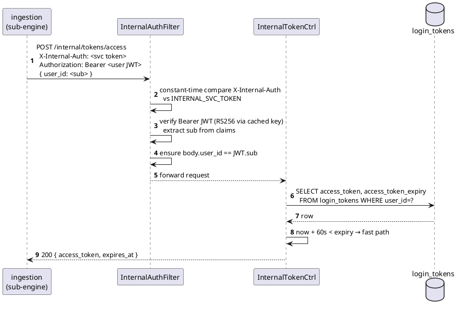

**What it does.** A sub-engine (ingestion here) needs to call Gmail on the user's behalf. It asks auth_engine for a valid Google access_token. Two auth layers stack: `X-Internal-Auth` (shared bearer) proves the caller is a legitimate service inside `kk-net`; the forwarded user JWT proves the request is scoped to that specific user. The `user_id` in the body **must** match the JWT's `sub` — that guardrail prevents any single compromised service from fetching tokens for arbitrary users. Fast path: stored access_token is still >60 s from expiry, return as-is. No Google roundtrip.

### 4.7 `POST /internal/tokens/access` — Refresh path

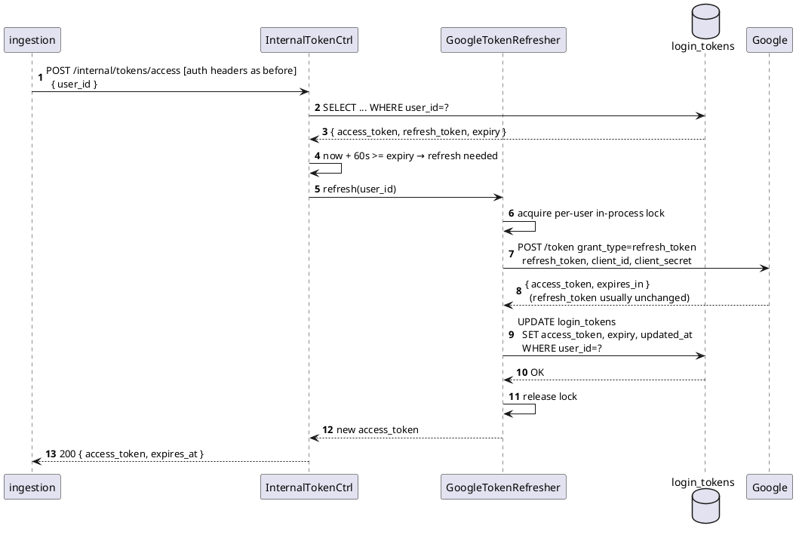

**What it does.** Stored access_token is expired (or within the 60 s pre-expiry buffer). auth_engine uses the stored `refresh_token` to call Google's `/token` with `grant_type=refresh_token`, gets a new access_token, updates the row, returns the new access_token. Per-user in-process lock ensures parallel callers for the same user coalesce onto one Google roundtrip — no thundering herd. Google usually keeps the same refresh_token but occasionally rotates it; we handle both cases by writing whatever comes back.

### 4.8 `POST /internal/tokens/access` — Refresh fails (`invalid_grant`)

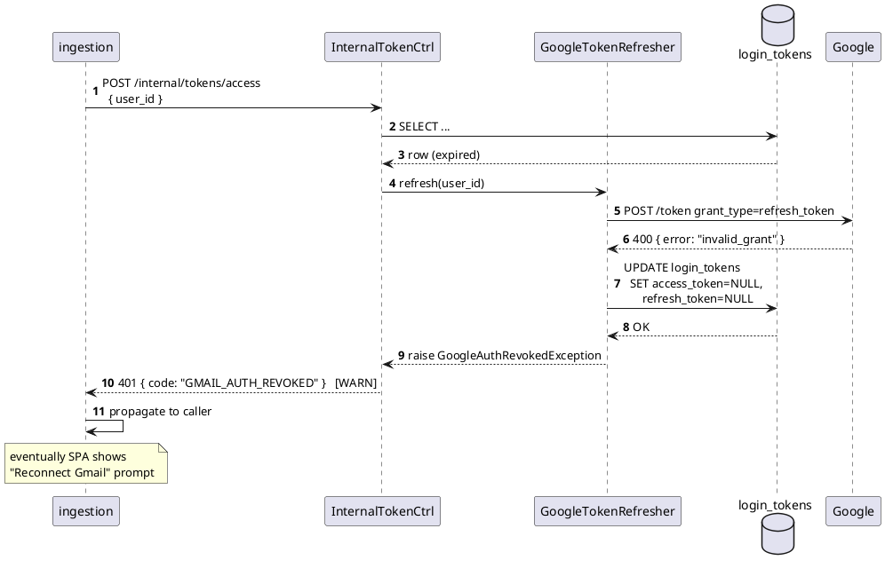

**What it does.** `invalid_grant` means Google no longer honours our refresh_token — usually because the user revoked access from their Google account settings, or Google security invalidated the grant. auth_engine nulls out both tokens (nothing recoverable without a new consent), returns `GMAIL_AUTH_REVOKED`. The sub-engine bubbles the error up. Eventually the SPA shows a "Reconnect Gmail" CTA that re-runs the OAuth flow with `prompt=consent`. **Important nuance:** the session JWT is still valid — the user remains logged in — they just can't do Gmail things until they re-consent. Login state and Gmail-access state are independent.

### 4.9 `POST /internal/tokens/invalidate`

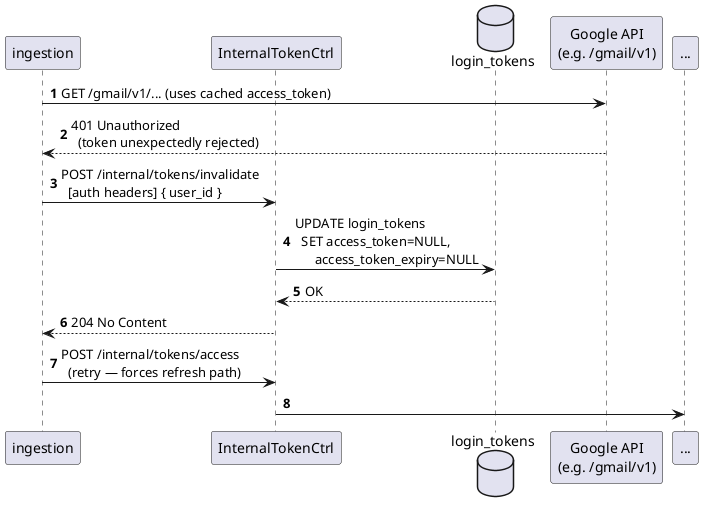

**What it does.** Sometimes a Google access_token is rejected by Google API before its recorded expiry — the user's Google session invalidated mid-flight, Google-side key rotation, etc. Rather than encoding heuristics for "is this token really still good," the sub-engine proactively tells auth_engine "this token is bad now." auth_engine simply nulls out the access_token; the next `/access` call sees NULL and takes the refresh path (Workflow 4.7). Idempotent — safe to call repeatedly.

### 4.10 Cross-cutting: JWT expiry recovery (Pattern A, Day 1)

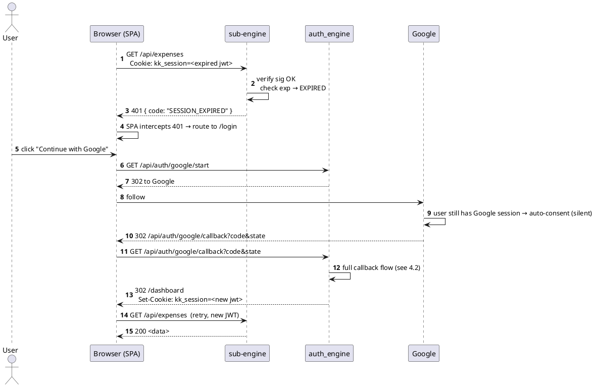

**What it does.** Session JWT hits its 24 h `exp`. Any sub-engine seeing the expired JWT returns `401 SESSION_EXPIRED` — sub-engines never mint or refresh JWTs. SPA intercepts the 401 and re-runs the full Google login. Google typically auto-consents silently because the user is still logged into Google in that browser, so the actual UX is one click. New JWT lands, original request retried. Zero server-side session state, zero refresh endpoint. Pattern B (dedicated `/api/auth/refresh` + refresh cookie) deferred to a later spec — see Open Q #7.

### 4.11 Cross-cutting: Manual key rotation

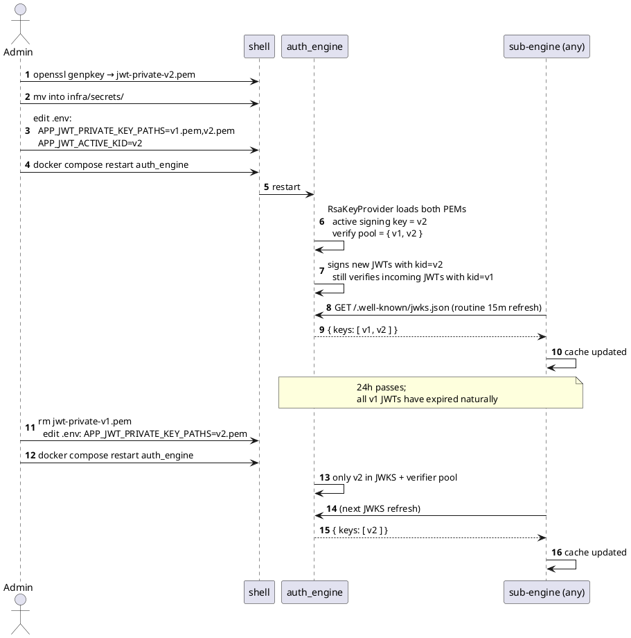

**What it does.** Zero-downtime signing key rotation. Two-phase: (Phase 1) publish both old + new keys in JWKS with distinct `kid`s, start signing new JWTs with the new `kid`, continue verifying old JWTs. (Phase 2) after max JWT lifetime (24 h) passes, all old-`kid` JWTs have expired naturally; drop the old key. Sub-engines refresh JWKS automatically — no code change, no coordinated deploy. Manual for Day 1; automate via cron only if we start rotating more than once a year.

## 5. Endpoints — public (browser-facing)

All public endpoints under `/api/auth/*` and `/.well-known/jwks.json`. `auth_engine` listens on port 8082. Nginx maps `/api/auth/**` → `auth_engine:8082/api/auth/**` and `/.well-known/jwks.json` → `auth_engine:8082/.well-known/jwks.json`.

### 5.1 `GET /api/auth/google/start`

Initiates the Google OAuth code flow. Sequence: §4.1.

| Field           | Value                                                                                                                                       |
|-----------------|---------------------------------------------------------------------------------------------------------------------------------------------|
| Auth            | none                                                                                                                                        |
| Query params    | `redirect?` — optional relative path validated against an allow-list (default `/dashboard`). Rejected if absolute URL.                       |
| Success         | `302` `Location: https://accounts.google.com/o/oauth2/v2/auth?...`; `Set-Cookie: kk_oauth_state=<32B base64>; HttpOnly; SameSite=Lax; Max-Age=600` |
| Scopes sent     | `openid email profile https://www.googleapis.com/auth/gmail.readonly`                                                                       |
| Extra OAuth params | `access_type=offline`, `prompt=consent` (first-time only — if refresh_token already in DB, omit `prompt` to skip consent screen)         |
| Failure         | `500` if `APP_GOOGLE_CLIENT_ID` / secret unset                                                                                              |

### 5.2 `GET /api/auth/google/callback`

Handles Google's redirect after user consent. Sequence: §4.2 (happy path), §4.3 (failure paths).

| Field           | Value                                                                                                                                       |
|-----------------|---------------------------------------------------------------------------------------------------------------------------------------------|
| Auth            | `kk_oauth_state` cookie must equal `?state=` param (CSRF protection)                                                                        |
| Query params    | `code` (String, required unless `error` present), `state` (String, required), `error?` (String)                                             |
| Behaviour       | Verify state → exchange `code` at Google `/token` → parse `id_token` payload via `IdTokenClaimsReader` (gates `email_verified==true`) → `POST /internal/users/upsert-from-google` on `user_engine` with `{sub, email, name, picture}` → upsert Google tokens in local `login_tokens` → mint RS256 session JWT (thick claims) → set cookie |
| Success         | `302 /dashboard` (or resolved `redirect` from `start`); `Set-Cookie: kk_session=<jwt>; HttpOnly; Secure; SameSite=Lax; Max-Age=86400`; `Set-Cookie: kk_oauth_state=; Max-Age=0` |
| Failure (redirects to `/login?err=<code>`) | `access_denied` · `state_invalid` · `code_exchange_failed` · `email_unverified` · `user_engine_unavailable` · `db_error`                    |

### 5.3 `POST /api/auth/logout`

Clears the session cookie. Sequence: §4.4.

| Field           | Value                                                                                    |
|-----------------|------------------------------------------------------------------------------------------|
| Auth            | `kk_session` cookie (accepted even if expired — logout is idempotent)                    |
| Body            | empty                                                                                    |
| CSRF            | `X-CSRF-Token` header must equal `kk_csrf` cookie (double-submit)                        |
| Success         | `204 No Content`; `Set-Cookie: kk_session=; Max-Age=0`; `Set-Cookie: kk_csrf=; Max-Age=0` |
| Failure         | `403 { "code": "CSRF_MISMATCH" }` if double-submit fails                                 |

Notes:
- No server-side session record to clear (JWTs are stateless).
- Google tokens in `login_tokens` are **not** wiped by logout — next login on this browser reuses them silently. Add `POST /api/auth/disconnect` in a later spec for full Google-account disassociation.

### 5.4 `GET /.well-known/jwks.json`

Publishes the RSA public key(s) sub-engines use to verify session JWTs. Sequence: §4.5.

| Field           | Value                                                                                                          |
|-----------------|----------------------------------------------------------------------------------------------------------------|
| Auth            | none — public keys are, by design, public                                                                      |
| Response        | `200 application/json`                                                                                         |
| Headers         | `Cache-Control: public, max-age=3600`                                                                          |
| Body            | JWK Set per RFC 7517: `{ "keys": [ { "kty": "RSA", "use": "sig", "alg": "RS256", "kid": "<id>", "n": "<b64u>", "e": "AQAB" } ] }` |
| Rotation        | During overlap window, returns both old and new keys (each with distinct `kid`); sub-engines pick by `kid`     |
| Failure         | `503` if `RsaKeyProvider` failed to load private key at startup (fail-fast means service should not be up)     |

## 6. Endpoints — internal (service-to-service)

All internal endpoints under `/internal/*`. Guarded by `InternalAuthFilter`.

**Authentication scheme:**

| Layer | Header | Purpose |
|-------|--------|---------|
| Service identity | `X-Internal-Auth: <INTERNAL_SVC_TOKEN>` | Constant-time compare against env-var-shared bearer token |
| User context (when required) | `Authorization: Bearer <user_jwt>` | Forward the caller's user session JWT so `auth_engine` can verify the request is user-scoped |

Missing / wrong `X-Internal-Auth` → `401 { "code": "INTERNAL_AUTH_MISSING" }`. Mismatch → `403 { "code": "INTERNAL_AUTH_INVALID" }`. User JWT missing on user-scoped endpoints → `401 { "code": "USER_CONTEXT_REQUIRED" }`.

### 6.1 `POST /internal/tokens/access`

Return a valid Google access_token for the specified user. Refresh via Google if the stored one is expired or near-expiry. Sequences: §4.6 (fast path), §4.7 (refresh path), §4.8 (`invalid_grant`).

| Field           | Value                                                                                                     |
|-----------------|-----------------------------------------------------------------------------------------------------------|
| Auth            | `X-Internal-Auth` (required) + `Authorization: Bearer <user_jwt>` (required)                              |
| Request         | `{ "user_id": "<sub>" }` — must equal `sub` claim in the forwarded JWT (mismatch → `403`)                 |
| Behaviour       | Look up `login_tokens` row. If `access_token_expiry > now + 60s` → return stored. Else → `POST accounts.google.com/o/oauth2/token grant_type=refresh_token` with stored `refresh_token` → `UPDATE login_tokens` → return new access_token. |
| Response        | `200 { "access_token": "<value>", "expires_at": "<ISO8601>" }`                                            |
| Concurrency     | Per-user in-process lock — parallel callers for the same user share one Google refresh call               |
| Failure         | `404 { "code": "USER_NOT_FOUND" }` — no `login_tokens` row for user_id                                    |
| Failure         | `401 { "code": "GMAIL_AUTH_REVOKED" }` — Google returned `invalid_grant`; sub-engine surfaces "reconnect Gmail" to SPA |
| Failure         | `502 { "code": "GOOGLE_UNAVAILABLE" }` — Google `/token` unreachable / 5xx                                |

### 6.2 `POST /internal/tokens/invalidate`

Force the next `POST /internal/tokens/access` to refresh regardless of stored expiry. Sequence: §4.9.

| Field           | Value                                                                    |
|-----------------|--------------------------------------------------------------------------|
| Auth            | `X-Internal-Auth` (required) + `Authorization: Bearer <user_jwt>` (required) |
| Request         | `{ "user_id": "<sub>" }`                                                 |
| Behaviour       | `UPDATE login_tokens SET access_token = NULL, access_token_expiry = NULL WHERE user_id=?` |
| Response        | `204 No Content`                                                         |
| Failure         | `404 { "code": "USER_NOT_FOUND" }`                                       |

### 6.3 Explicitly not present on Day 1

| Endpoint                     | Why deferred                                                                                                     |
|------------------------------|------------------------------------------------------------------------------------------------------------------|
| `POST /api/auth/refresh`     | Pattern A (full re-login on expiry) chosen for Day 1. Adding refresh cookies + refresh-tokens table is Day-N.    |
| `GET /api/auth/me`           | Profile lives in `user_engine`; SPA reads thick JWT claims for display fields on Day 1, calls `user_engine` later.|
| `POST /api/auth/disconnect`  | Full Google-account disassociation (revoke refresh_token at Google + wipe row) — later spec.                     |
| `POST /internal/keys/rotate` | Manual admin operation for Day 1 (regenerate PEM, restart) — see §4.11.                                          |

## 7. Session JWT — claims + lifecycle

### 7.1 Claim set

```json
{
  "iss":     "auth_engine",
  "sub":     "1029384756...",           // Google sub, doubles as our user_id
  "email":   "tb@gmail.com",
  "name":    "TB",
  "picture": "https://...",
  "scope":   ["gmail.readonly"],
  "iat":     1721908800,
  "exp":     1721995200                  // iat + 24h
  // header: alg=RS256, kid=<current>
}
```

Thick JWT — SPA reads display fields (`email`, `name`, `picture`) without a `user_engine` round-trip. Fields are a snapshot at login time; profile changes require re-login to reflect in the JWT.

### 7.2 Lifecycle

| Event | Behaviour | Sequence |
|-------|-----------|----------|
| Mint | On successful callback. Not persisted anywhere server-side. | §4.2 |
| Verify | Any engine holding the JWKS-fetched public key does this locally. No round-trip to `auth_engine`. | §4.5 |
| Expiry (`exp` reached) | Any sub-engine returns `401 { "code": "SESSION_EXPIRED" }`. SPA redirects browser to `/login` (Pattern A). No refresh endpoint. | §4.10 |
| Revocation | Not supported — stateless JWTs. Damage window ≤ 24h. Logout only clears the browser cookie. | §4.4 |
| Signing key rotation | `auth_engine` publishes new key alongside old (both in JWKS, distinct `kid`). New JWTs signed with new `kid`. After 24h, old key removed. | §4.11 |

## 8. Key management — RSA keypair

### 8.1 Storage

| Material    | Where                                                                     | Access                      |
|-------------|---------------------------------------------------------------------------|-----------------------------|
| Private key | PEM file on disk, mounted read-only into `auth_engine` container          | `auth_engine` process only  |
| Public key  | Derived in-memory from private at startup; served via JWKS                | Any HTTP caller             |

Env var: `APP_JWT_PRIVATE_KEY_PATH` (default `/run/secrets/jwt-private.pem`). Container starts fail-fast if the file is missing or unreadable.

### 8.2 Generation

Manual, one-time per environment:

```bash
openssl genpkey -algorithm RSA -pkeyopt rsa_keygen_bits:2048 \
  -out infra/secrets/jwt-private.pem
chmod 600 infra/secrets/jwt-private.pem
```

Never commit the PEM. Add `infra/secrets/*.pem` to `.gitignore`.

### 8.3 Rotation

Manual, on demand — full sequence in §4.11.

### 8.4 Sub-engine consumption

Documented for reference; implemented in shared `jwt-verifier` library. Behaviour in §4.5.

- Fetch `LOGIN_ENGINE_JWKS_URL` (default `http://auth_engine:8082/.well-known/jwks.json`) at startup, with retry/backoff.
- Cache in memory for 15 min.
- On `kid` cache-miss: refetch immediately.

## 9. Data model

Only one table lives in `auth_engine`. User profile (`khata_users`) belongs to `user_engine` and is out of scope for this spec.

### 9.1 `login_tokens` (new, `auth_engine`-owned)

| Column                | Type          | Constraints                          | Notes                                                     |
|-----------------------|---------------|--------------------------------------|-----------------------------------------------------------|
| user_id               | `TEXT`        | PK                                   | Google `sub` — matches `khata_users.user_id` in `user_engine` |
| access_token          | `TEXT`        |                                      | encrypted at rest (AES-GCM, `enc_v1:<iv>:<ct>` prefix)    |
| access_token_expiry   | `TIMESTAMPTZ` |                                      | absolute UTC                                              |
| refresh_token         | `TEXT`        |                                      | encrypted at rest                                         |
| scope                 | `TEXT`        | NOT NULL                             | space-separated Google scopes granted at last consent     |
| created_at            | `TIMESTAMPTZ` | NOT NULL, default `now()`            |                                                           |
| updated_at            | `TIMESTAMPTZ` | NOT NULL, default `now()`            | maintained by trigger on `UPDATE`                         |

Migrations: `java/auth_engine/src/main/resources/db/migration/V1__login_tokens.sql` (Flyway).

## 10. Exception handling

| Trigger                                           | Type / Error code                | HTTP | Response body / redirect                             | Log level |
|---------------------------------------------------|----------------------------------|------|------------------------------------------------------|-----------|
| Google returns `error=access_denied`              | `LoginCancelledException`        | 302  | `/login?err=access_denied`                           | INFO      |
| `state` cookie missing or mismatch                | `CsrfMismatchException`          | 302  | `/login?err=state_invalid`                           | WARN      |
| `POST /token` non-2xx / network                   | `GoogleTokenExchangeFailed`      | 302  | `/login?err=code_exchange_failed`                    | ERROR     |
| `id_token` payload unparseable                    | `IdTokenMalformedException`      | 302  | `/login?err=code_exchange_failed`                    | ERROR     |
| `email_verified` false / missing                  | `EmailUnverifiedException`       | 302  | `/login?err=email_unverified`                        | WARN      |
| `user_engine.upsertFromGoogle` non-2xx            | `UserEngineUnavailableException` | 302  | `/login?err=user_engine_unavailable`                 | ERROR     |
| `login_tokens` upsert fails                       | `TokenPersistenceException`      | 302  | `/login?err=db_error`                                | ERROR     |
| Session JWT missing / expired at protected route  | `SessionInvalidException`        | 401  | `{ "code": "SESSION_EXPIRED" }`                      | INFO      |
| CSRF token mismatch on logout                     | `CsrfMismatchException`          | 403  | `{ "code": "CSRF_MISMATCH" }`                        | WARN      |
| `X-Internal-Auth` missing on `/internal/**`       | `InternalAuthMissing`            | 401  | `{ "code": "INTERNAL_AUTH_MISSING" }`                | WARN      |
| `X-Internal-Auth` invalid                         | `InternalAuthInvalid`            | 403  | `{ "code": "INTERNAL_AUTH_INVALID" }`                | ERROR     |
| `Authorization` header missing on user-scoped internal call | `UserContextRequired`   | 401  | `{ "code": "USER_CONTEXT_REQUIRED" }`                | WARN      |
| Body `user_id` != JWT `sub`                       | `UserContextMismatch`            | 403  | `{ "code": "USER_CONTEXT_MISMATCH" }`                | WARN      |
| Google `POST /token` returns `invalid_grant` on refresh | `GoogleAuthRevokedException` | 401 | `{ "code": "GMAIL_AUTH_REVOKED" }`                   | WARN      |
| Google unreachable on refresh                     | `UpstreamUnavailable`            | 502  | `{ "code": "GOOGLE_UNAVAILABLE" }`                   | ERROR     |
| `login_tokens` row missing on internal call       | `LoginTokenNotFound`             | 404  | `{ "code": "USER_NOT_FOUND" }`                       | WARN      |
| Private key PEM missing / unreadable at boot      | `MissingSigningKey`              | —    | fail-fast on boot                                    | FATAL     |

Realised via a `@RestControllerAdvice` (`AuthExceptionHandler`) split into: a public advice for `/api/**` (302-redirect on OAuth errors, 401/403 on session/CSRF errors) and an internal advice for `/internal/**` (JSON error bodies, no redirects).

## 11. Deployment

| Aspect                | Detail                                                                                                                                     |
|-----------------------|--------------------------------------------------------------------------------------------------------------------------------------------|
| Compose service       | `auth_engine` (replaces earlier `user_engine` / `login_engine` scaffold)                                                                   |
| Build order           | `cd java && ./gradlew :auth_engine:bootJar` → `docker compose -f infra/docker-compose.yml up --build auth_engine postgres`                 |
| Env vars — required   | `GOOGLE_CLIENT_ID`, `GOOGLE_CLIENT_SECRET`, `APP_JWT_PRIVATE_KEY_PATH`, `INTERNAL_SVC_TOKEN`, `USER_ENGINE_BASE_URL`, `APP_OAUTH_REDIRECT_URI`, `DB_URL`, `DB_USER`, `DB_PASSWORD` |
| Env vars — optional   | `APP_LOGIN_SUCCESS_URL` (default `/dashboard`), `APP_LOGIN_FAILURE_URL` (default `/login`), `APP_JWT_EXP_HOURS` (default `24`), `APP_OAUTH_SCOPES` (default `openid,email,profile,gmail.readonly`) |
| Secret mounts         | `infra/secrets/jwt-private.pem` → `/run/secrets/jwt-private.pem:ro`. Google OAuth `client_id` / `client_secret` are sourced from env vars (see §11.3), **not** from `gcloud_app_credentials.json` — that file is a passive human record only. |
| Postgres init         | Fresh volume: `infra/postgres/init/02_login_tokens.sql`. On existing volume: Flyway V1 runs at boot.                                       |
| Feature flag          | `APP_AUTH_ENABLED` (default `true`); when `false`, all `/api/auth/*` return `503`                                                          |
| Local dev             | `./gradlew :auth_engine:bootRun`, `APP_OAUTH_REDIRECT_URI=http://localhost:8082/api/auth/google/callback`. Register that redirect URI in the GCP OAuth client. |
| Rollback              | `docker compose down && git revert <sha> && docker compose up --build`. Flyway rollback via a new `V2__revert_login_tokens.sql`.          |

### 11.1 `docker-compose.yml` diff

| Change | Location                                    | Detail                                                                                                       |
|--------|---------------------------------------------|--------------------------------------------------------------------------------------------------------------|
| +      | rename service `login_engine` → `auth_engine` | container_name `kk-auth-engine`, build context `../java/auth_engine`                                        |
| +      | `services.auth_engine.environment`          | `GOOGLE_CLIENT_SECRET`, `APP_JWT_PRIVATE_KEY_PATH`, `INTERNAL_SVC_TOKEN`, `USER_ENGINE_BASE_URL=http://user_engine:8083`, `APP_OAUTH_REDIRECT_URI` |
| +      | `services.auth_engine.volumes`              | `- ../infra/secrets/jwt-private.pem:/run/secrets/jwt-private.pem:ro` (only JWT signing key is file-mounted; Google OAuth creds come from env — see §11.3) |
| ~      | `services.web.depends_on`                   | `auth_engine` (replacing `login_engine`)                                                                     |
| ~      | `services.web.nginx` proxy                  | `/api/auth/` and `/.well-known/jwks.json` → `auth_engine:8082`                                               |

### 11.2 `build.gradle` diff (`auth_engine`)

| Change | Line                                                            | Reason                                                       |
|--------|-----------------------------------------------------------------|--------------------------------------------------------------|
| +      | `implementation libs.flyway.core`                               | run migrations at startup                                    |
| +      | `runtimeOnly    libs.flyway.database.postgresql`                | Flyway 10+ needs the db module                               |
| +      | `implementation libs.jjwt.api / -impl / -jackson`               | JWT sign + verify                                            |
| +      | `implementation libs.bouncycastle` (or JDK builtin)             | RSA PEM parsing                                              |
| +      | `implementation libs.spring.boot.starter.webflux` (or RestClient — bundled with `-starter-web` since Boot 3.2) | HTTP calls to Google + user_engine |
| +      | test: `implementation libs.wiremock`                            | mock Google token + user_engine endpoints in tests           |

### 11.3 Google OAuth credentials — configuration source

**Decision (2026-07-26):** OAuth `client_id` / `client_secret` are configured **via environment variables only**. The `resources/gcloud_app_credentials.json` file downloaded from GCP is a passive human record — mirrored into `resources/g_credentials.md` — and is **not read at runtime**. Both files stay gitignored.

Rationale: single source of truth; twelve-factor; identical wiring across docker compose + IntelliJ `bootRun` + future cloud deploy (Cloud Run et al. inject env vars, not file mounts); rotating a secret means editing one env var, not editing a JSON.

**OAuth client type:** **Web application** (not Desktop / `installed`). Server-side redirect flow requires the Web client type; `http://localhost:...` redirect URIs are explicitly permitted by Google for Web clients during development. Two authorized redirect URIs registered in GCP:
- `http://localhost:3000/api/auth/google/callback` — full docker compose stack, nginx-proxied
- `http://localhost:8082/api/auth/google/callback` — `./gradlew :auth_engine:bootRun` direct-to-Spring

**Env var contract (Spring `@ConfigurationProperties`, prefix `app.google`):**

| Env var                    | `application.yml` key         | Source                                              | Notes                                                                     |
|----------------------------|-------------------------------|-----------------------------------------------------|---------------------------------------------------------------------------|
| `GOOGLE_CLIENT_ID`         | `app.google.client-id`        | GCP OAuth client (`.web.client_id`)                 | Required. Fail-fast on boot if unset.                                     |
| `GOOGLE_CLIENT_SECRET`     | `app.google.client-secret`    | GCP OAuth client (`.web.client_secret`)             | Required. Confidential.                                                    |
| `APP_OAUTH_REDIRECT_URI`   | `app.google.redirect-uri`     | Per-environment                                      | Must byte-exactly match one of the redirect URIs registered in GCP.       |
| —                          | `app.google.auth-uri`         | Hardcoded default `https://accounts.google.com/o/oauth2/v2/auth` | Constant; overridable only if Google moves the endpoint.                  |
| —                          | `app.google.token-uri`        | Hardcoded default `https://oauth2.googleapis.com/token`          | Constant; same override rule.                                             |
| `APP_OAUTH_SCOPES`         | `app.google.scopes`           | Optional; default `openid,email,profile,gmail.readonly`          | Comma-separated.                                                          |

Unused fields from the GCP JSON (`project_id`, `auth_provider_x509_cert_url`) are dropped — id_token signature verification is skipped (Open Q #15).

**Where env vars live per runtime mode:**

| Mode                    | Source of env vars                                                                                                                                                              |
|-------------------------|---------------------------------------------------------------------------------------------------------------------------------------------------------------------------------|
| Docker compose          | `infra/.env` (gitignored) auto-loaded by `docker compose` when sitting next to `docker-compose.yml`. Compose service references vars via `${GOOGLE_CLIENT_ID}` etc.             |
| IntelliJ (`bootRun`)    | **EnvFile** plugin pointed at `infra/.env` on the run configuration for `AuthEngineApplication`. Override `APP_OAUTH_REDIRECT_URI` to the `:8082` variant in a `.env.local`.    |
| Terminal (`./gradlew`)  | `set -a && source infra/.env && set +a && APP_OAUTH_REDIRECT_URI=http://localhost:8082/api/auth/google/callback ./gradlew :auth_engine:bootRun`                                 |
| Cloud (future)          | Secret manager (GCP Secret Manager / etc.) injects env vars at container start. No code change.                                                                                 |

**Committed sibling:** `infra/.env.example` lists the required keys with blank values as documentation for future contributors — safe to commit.

## 12. Test plan

| Layer               | Scope                                                                                                    | Tooling                                          |
|---------------------|----------------------------------------------------------------------------------------------------------|--------------------------------------------------|
| Unit — controllers  | State cookie generation, redirect URL construction, JWKS body shape                                      | JUnit 5 + MockMvc + AssertJ                      |
| Unit — services     | `SessionJwtIssuer` sign; `IdTokenClaimsReader` parse + `email_verified` gate; `RsaKeyProvider` PEM load  | JUnit 5 + Mockito                                |
| Unit — token flow   | `GoogleTokenRefresher` refresh path + `invalid_grant` handling                                           | JUnit 5 + WireMock                               |
| Slice — public API  | `/api/auth/**` full callback happy path + all failure redirects                                          | `@WebMvcTest` + Mockito                          |
| Slice — internal API| `/internal/tokens/**` — auth header combinations, `sub` mismatch, `USER_NOT_FOUND`                       | `@WebMvcTest`                                    |
| Slice — JWKS        | `/.well-known/jwks.json` — response shape, `Cache-Control`, `kid` presence                               | `@WebMvcTest`                                    |
| Integration — DB    | `LoginTokenRepository` + Flyway migration                                                                | Testcontainers postgresql                        |
| Integration — Google| `GoogleOAuthClient` + `GoogleTokenRefresher` against WireMock                                            | Testcontainers + WireMock                        |
| Contract            | `POST /internal/users/upsert-from-google` shape agreed with `user_engine`                                | Pact or hand-rolled JSON schema check            |
| E2E manual          | Full compose stack, real Google consent → JWT set → JWKS reachable → sub-engine verifies                 | manual checklist                                 |

Manual E2E checklist:
1. Register redirect URI in GCP console: `http://localhost:3000/api/auth/google/callback`.
2. Generate `infra/secrets/jwt-private.pem`.
3. `docker compose -f infra/docker-compose.yml up --build`.
4. `curl -i http://localhost:8082/.well-known/jwks.json` → 200, JWK Set with one key.
5. Browser-drive login → land on `/dashboard`, inspect `Set-Cookie: kk_session=`.
6. Decode JWT payload at jwt.io — verify claims + `kid`.
7. `psql -c "SELECT user_id, access_token_expiry FROM login_tokens;"` → row present.
8. `curl -i -H "X-Internal-Auth: $INTERNAL_SVC_TOKEN" -H "Authorization: Bearer <jwt>" -d '{"user_id":"<sub>"}' http://localhost:8082/internal/tokens/access` → 200 with fresh access_token.
9. `POST /api/auth/logout` with CSRF header → 204, cookie cleared.

## 13. Open questions

| # | Question                                                                                                    | Proposed answer / recommendation                                                                                                                                        | Owner | Decision by |
|---|-------------------------------------------------------------------------------------------------------------|-------------------------------------------------------------------------------------------------------------------------------------------------------------------------|-------|-------------|
| 1 | Postgres DB / user / password defaults: `.env` override vs hardcoded `tb/tb` in `docker-compose.yml`?       | **`.env` override.** Defaults `kharchakhata/kharchakhata/kharchakhata` stay in compose; document `tb/tb` in `infra/.env.example`.                                       | tb    | 2026-07-28  |
| 2 | Callback URL: register `http://localhost:3000/api/auth/google/callback` (nginx-proxied) or `:8082`?         | **`:3000/...`** — browser follows the redirect, and it only knows the SPA origin. `:8082` only used for `bootRun` local dev.                                            | tb    | 2026-07-28  |
| 3 | Re-consent on every login vs. only when refresh_token missing?                                              | **Only when refresh_token missing** in `login_tokens`. First login always forces `prompt=consent`; subsequent logins omit it.                                           | tb    | 2026-07-30  |
| 4 | CSRF strategy on `POST /api/auth/logout` and future POSTs                                                   | **Double-submit cookie.** `kk_csrf` (non-HttpOnly) set at login; require `X-CSRF-Token` header equal to cookie on unsafe methods.                                       | tb    | 2026-08-05  |
| 5 | Encrypt `access_token` / `refresh_token` at rest?                                                           | **Yes — AES-GCM with `APP_TOKEN_ENC_KEY`.** `enc_v1:<iv>:<ct>` prefix for future key rotation.                                                                          | tb    | 2026-08-01  |
| 6 | Refresh-token rotation trigger: cron warm-up vs. lazy-on-read                                               | **Lazy-on-read** in `POST /internal/tokens/access` (60s pre-expiry threshold). Simpler; no scheduler.                                                                    | tb    | 2026-08-05  |
| 7 | Session JWT refresh (Pattern B: `POST /api/auth/refresh` + `session_refresh_tokens` table)?                 | **Deferred.** Day 1 uses Pattern A (full re-login on 401). Revisit if user complains about 24h friction or JWT lifetime drops below ~1h.                                | tb    | 2026-08-15  |
| 8 | Shared JWT verification library — new `java/common/jwt-verifier/` subproject?                               | **Yes** — one Gradle subproject, one JAR. Used by `user_engine`, `ingestion`, and every future engine. Config via `LOGIN_ENGINE_JWKS_URL` env.                          | tb    | 2026-07-30  |
| 9 | `INTERNAL_SVC_TOKEN` rotation policy                                                                        | **Manual, on suspected compromise only** for Day 1. Add scheduled rotation once we have >3 internal callers.                                                            | tb    | 2026-09-01  |
| 10 | Sign-out-everywhere / session revocation                                                                    | **Not supported Day 1.** Accept 24h damage window. Add denylist (Redis or `revoked_jwts` table) when actual multi-device users appear.                                  | tb    | 2026-09-01  |
| 11 | `sub` uniqueness scoping — what if we add a second GCP OAuth client?                                        | **Pin to a single OAuth client.** If second client added, must also add `google_client_id` column to `login_tokens` + composite key or migration path.                   | tb    | 2026-08-15  |
| 12 | Audit log for auth events (login, refresh, logout, invalid_grant)                                           | **Structured SLF4J logs (`event=<kind>`)** on Day 1. Add `auth_events` table when audit becomes a compliance requirement.                                               | tb    | 2026-09-15  |
| 13 | Rate limiting on `/internal/tokens/access`                                                                  | **Not on Day 1.** Add token-bucket per user_id when we have >1 sub-engine calling in production.                                                                        | tb    | 2026-09-01  |
| 14 | Health/readiness endpoints                                                                                  | **`/actuator/health` (baseline)** and `/actuator/health/readiness` includes JWKS-key-loaded + DB-reachable. Do not include Google reachability (would create false alarms). | tb    | 2026-07-30  |
| 15 | `id_token` signature verification (RS256 + JWKS against Google)?                                            | **Skip** (decided 2026-07-25). id_token arrives back-channel over TLS from Google `/token`; `IdTokenClaimsReader` base64-decodes payload and enforces `email_verified==true`. Revisit if we ever accept id_tokens from the browser. | tb (decided) | 2026-07-25 |
| 16 | User PK type: `TEXT` (Google `sub`) vs surrogate `BIGSERIAL`?                                               | **`TEXT` = Google `sub`** (decided 2026-07-25). Uniformly used across `login_tokens` here and `khata_users` in `user_engine`. Escape hatch documented if non-Google auth is ever added. | tb (decided) | 2026-07-25 |
| 17 | Split into `auth_engine` (auth + tokens) vs. fold into `user_engine` (auth + profile + workflows)?          | **Split — `auth_engine`** (decided 2026-07-25). Single responsibility, small blast radius for signing key + refresh tokens, clean narrow API for downstream engines.    | tb (decided) | 2026-07-25 |
| 18 | Signing algorithm: HS256 vs RS256                                                                           | **RS256** (decided 2026-07-25). Private key stays in `auth_engine`; sub-engines get public key via JWKS. Cost small, security win real, avoids future migration.        | tb (decided) | 2026-07-25 |
