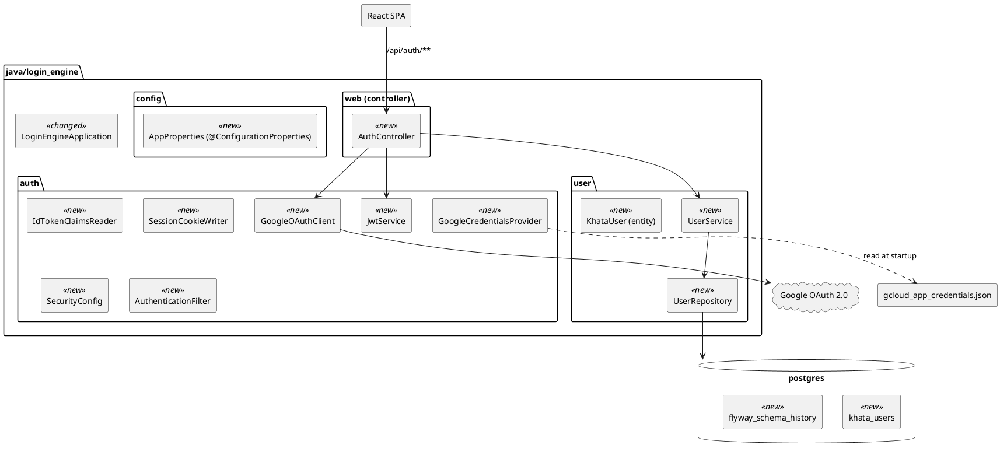
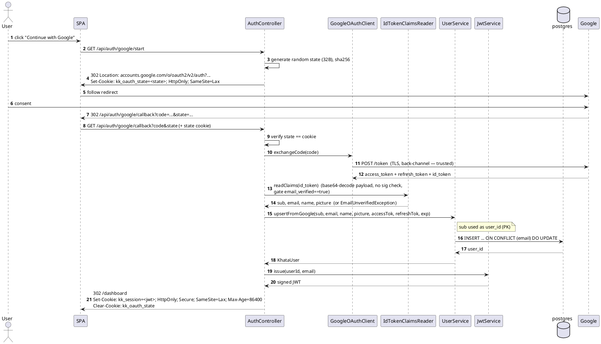
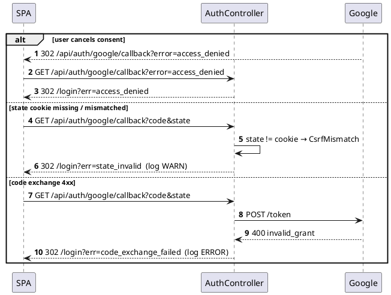
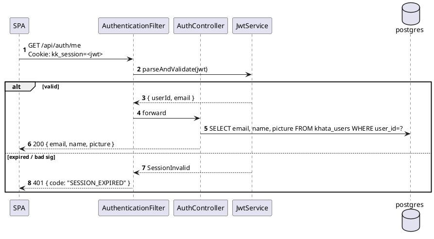

# Spec: User login — `login_engine` microservice (Google OAuth + session)

| Field       | Value                                                                                     |
|-------------|-------------------------------------------------------------------------------------------|
| Feature     | Google OAuth server-flow, user upsert into `khata_users`, JWT session cookie             |
| Engine(s)   | `java/login_engine`, `infra/postgres`                                                      |
| Owner       | tb                                                                                        |
| Status      | draft                                                                                     |
| Date        | 2026-07-25                                                                                |
| jlog day    | Day 2 (`resources/jlog/app_development_log.md`)                                           |
| Related     | Design brief `resources/design/user_login/user_login_index.md`; sibling spec `2026-07-25-user-login-web-ui.md` |

## 1. Motivation

A backend scaffold exists at `java/user_engine` (port 8082, Spring Boot, Spring
Security dep, JJWT dep) but has no endpoints and no persistence. Per BRD, login
and token lifecycle live in a dedicated `login_engine` — separate from a future
`user_engine` (profile/preferences/workflows). This spec (a) renames the
existing scaffold `java/user_engine` → `java/login_engine`, and (b) turns it
into a working Google-OAuth login service that persists tokens in `khata_users`
and mints a session JWT. Without it the SPA has nowhere to authenticate against
and downstream engines have no access/refresh tokens for Gmail.

## 2. Scope

| In                                                                        | Out                                                          |
|---------------------------------------------------------------------------|--------------------------------------------------------------|
| `GET /api/auth/google/start` — build authorization URL, set `state` cookie | Multi-provider auth (Apple / Microsoft)                     |
| `GET /api/auth/google/callback` — exchange code, persist user, set session | Role-based access control                                   |
| `GET /api/auth/me` — return current user profile                          | User profile edit endpoints                                  |
| `POST /api/auth/logout` — clear session cookie                            | Admin / audit UI                                             |
| JWT session in httpOnly cookie, HS256 signed via `APP_JWT_SECRET`         | Refresh-token rotation UI                                    |
| Refresh-access-token helper (`GoogleTokenRefresher`) used internally      | Public "get Gmail access token" API (added when scan needs it) |
| `khata_users` table + Flyway migration V1                                | Multi-tenant / org tables                                    |
| Env-driven load of `gcloud_app_credentials.json`                          | Client-secret rotation automation                            |

## 3. Architecture change

Legend: `<<new>>` added by this spec, `<<changed>>` altered, `<<removed>>` deleted.

## 4. Workflows

### 4.1 Happy path — first-time login

### 4.2 Failure path — Google returns `?error=access_denied` or state mismatch

### 4.3 Session check on subsequent requests

## 5. API contracts

All endpoints under `/api/auth/*`. `login_engine` listens on port 8082 (see
`application.yml`). Nginx maps `/api/**` → `login_engine:8082/api/**`.

### 5.1 `GET /api/auth/google/start`

| Field           | Value                                                                                            |
|-----------------|--------------------------------------------------------------------------------------------------|
| Auth            | none                                                                                             |
| Query params    | `redirect?` (String, optional relative path, default `/dashboard`) — validated against allow-list |
| Request DTO     | —                                                                                                |
| Response        | `302` Location: Google OAuth URL. `Set-Cookie: kk_oauth_state=<32B base64>; HttpOnly; SameSite=Lax; Max-Age=600` |
| Scopes sent     | `openid email profile https://www.googleapis.com/auth/gmail.readonly`                            |
| Extra params    | `access_type=offline`, `prompt=consent` (first-time to guarantee refresh_token), `state`, `redirect_uri` |
| Failure         | `500` if `AppProperties.google.clientId` unset                                                   |

### 5.2 `GET /api/auth/google/callback`

| Field           | Value                                                                                            |
|-----------------|--------------------------------------------------------------------------------------------------|
| Auth            | `kk_oauth_state` cookie must equal `?state=`                                                     |
| Query params    | `code` (String, required unless `error` present), `state` (String, required), `error?` (String)  |
| Success         | `302 /dashboard` (or the `redirect` captured in state), `Set-Cookie: kk_session=<jwt>; HttpOnly; Secure; SameSite=Lax; Max-Age=86400`, `Set-Cookie: kk_oauth_state=; Max-Age=0` |
| Failure         | `302 /login?err=<code>` — codes: `access_denied`, `state_invalid`, `code_exchange_failed`, `email_unverified`, `db_error` |

### 5.3 `GET /api/auth/me`

| Field           | Value                                                                              |
|-----------------|------------------------------------------------------------------------------------|
| Auth            | `kk_session` cookie (JWT)                                                          |
| Response DTO    | `MeResponse { email: String, name: String?, picture: String? }`                    |
| Success         | `200 application/json`                                                             |
| Failure         | `401 { code: "SESSION_EXPIRED" }` — no cookie, expired, or bad signature           |

### 5.4 `POST /api/auth/logout`

| Field           | Value                                                                              |
|-----------------|------------------------------------------------------------------------------------|
| Auth            | `kk_session` cookie (accepted even if expired — logout is idempotent)              |
| Request         | empty body; `X-CSRF-Token` header (double-submit — must equal cookie `kk_csrf`)    |
| Response        | `204 No Content`; `Set-Cookie: kk_session=; Max-Age=0`, `Set-Cookie: kk_csrf=; Max-Age=0` |
| Failure         | `403` if CSRF header/cookie mismatch                                               |

### 5.5 Internal helper — `GoogleTokenRefresher` (Java API, not HTTP)

| Method                                              | Behaviour                                                                                       |
|-----------------------------------------------------|-------------------------------------------------------------------------------------------------|
| `String currentAccessToken(String userId)`          | `userId` = Google `sub`. If `access_token_expiry` > now + 60s → return stored; else refresh via Google, `UPDATE` row, return new token |
| `void invalidate(String userId)`                    | Sets `access_token = null`; downstream retries force full refresh                               |

## 6. Database schema

### 6.1 `khata_users` (new)

| Column                 | Type          | Constraints                             | Notes                                          |
|------------------------|---------------|-----------------------------------------|------------------------------------------------|
| user_id                | `TEXT`        | PK                                      | Google `sub` claim — stable, opaque, ≤255 chars. Replaces auto-increment from design brief (see open Q #14). |
| email                  | `TEXT`        | NOT NULL, UNIQUE                        | idx `khata_users_email_uidx` (implicit)       |
| name                   | `TEXT`        |                                         | from id_token                                  |
| picture                | `TEXT`        |                                         | avatar URL                                     |
| access_token           | `TEXT`        |                                         | encrypted at rest (see open Q #4)              |
| access_token_expiry    | `TIMESTAMPTZ` |                                         | absolute UTC                                   |
| refresh_token          | `TEXT`        |                                         | encrypted at rest                              |
| created_at             | `TIMESTAMPTZ` | NOT NULL, default `now()`               |                                                |
| updated_at             | `TIMESTAMPTZ` | NOT NULL, default `now()`               | maintained by trigger on `UPDATE`              |

Design brief asks for `updates_at` — interpreted as `updated_at`
(refreshed whenever the row is touched, including token refresh). Add a trigger
`khata_users_touch_updated_at` that sets it on every `UPDATE`.

`google_sub` column dropped — `sub` value now lives directly in `user_id` PK, so no separate column needed. Upsert key is `user_id`; email uniqueness still enforced to catch conflicting accounts.

### 6.2 Migrations

| File                                                                                | Applied by          |
|-------------------------------------------------------------------------------------|---------------------|
| `infra/postgres/init/02_khata_users.sql` (CREATE TABLE + trigger; idempotent)     | postgres init (fresh volume only) |
| `java/login_engine/src/main/resources/db/migration/V1__khata_users.sql`             | Flyway (added dep — see §8)      |

Both files carry the same DDL so a fresh compose volume works without Flyway
having to bootstrap, and Flyway takes over for later evolutions.

## 7. Exception handling

| Trigger                                          | Type / Error code            | HTTP | User message (in redirect / body)                | Log level |
|--------------------------------------------------|------------------------------|------|--------------------------------------------------|-----------|
| Google returns `error=access_denied`             | `LoginCancelledException`    | 302  | redirect `/login?err=access_denied`              | INFO      |
| `state` cookie missing or mismatch               | `CsrfMismatchException`      | 302  | redirect `/login?err=state_invalid`              | WARN      |
| `POST /token` non-2xx / network                  | `GoogleTokenExchangeFailed`  | 302  | redirect `/login?err=code_exchange_failed`       | ERROR     |
| id_token payload unparseable (malformed JWT)     | `IdTokenMalformedException` (from `IdTokenClaimsReader`) | 302 | redirect `/login?err=code_exchange_failed` | ERROR |
| `email_verified` claim is false / missing        | `EmailUnverifiedException` (from `IdTokenClaimsReader`)  | 302 | redirect `/login?err=email_unverified`  | WARN  |
| DB upsert fails                                  | `UserPersistenceException`   | 302  | redirect `/login?err=db_error`                   | ERROR     |
| Missing / expired `kk_session` on protected API  | `SessionInvalidException`    | 401  | `{ "code": "SESSION_EXPIRED" }`                  | INFO      |
| CSRF token mismatch on logout                    | `CsrfMismatchException`      | 403  | `{ "code": "CSRF_MISMATCH" }`                    | WARN      |
| Refresh-token exchange returns `invalid_grant`   | `GoogleAuthRevokedException` | —    | (internal — downstream ingestion sees 401)       | WARN      |
| `gcloud_app_credentials.json` absent at startup  | `MissingGoogleCredentials`   | —    | fail-fast on boot                                | FATAL     |

Realised via a `@RestControllerAdvice` (`AuthExceptionHandler`) + a custom
`AccessDeniedHandler` for CSRF.

## 8. Deployment strategy

| Aspect                | Detail                                                                                                                              |
|-----------------------|-------------------------------------------------------------------------------------------------------------------------------------|
| Compose services      | `login_engine` (rebuilt — new endpoints + Flyway dep), `postgres` (init SQL added — only reruns on empty volume)                    |
| Build order           | `cd java && ./gradlew :login_engine:bootJar` → `docker compose -f infra/docker-compose.yml up --build login_engine postgres`         |
| New env vars          | `GOOGLE_CLIENT_SECRET` (required); `GOOGLE_CREDENTIALS_PATH` (default `/run/secrets/gcloud_app_credentials.json`); `APP_OAUTH_REDIRECT_URI` (local: `http://localhost:8082/api/auth/google/callback`; docker: `http://web/api/auth/google/callback`); `APP_LOGIN_SUCCESS_URL` (default `/dashboard`); `APP_LOGIN_FAILURE_URL` (default `/login`) |
| Existing env vars     | `GOOGLE_CLIENT_ID`, `APP_JWT_SECRET`, `CORS_ALLOWED_ORIGINS` (already wired in `application.yml`)                                  |
| Secret file mount     | `resources/gcloud_app_credentials.json` mounted read-only at path in `GOOGLE_CREDENTIALS_PATH`. Add a compose `secrets:` entry or `volumes:` bind. |
| Postgres data reset   | Required once for the fresh init SQL: `docker volume rm kharchakhata_kk-pg-data`. After that, Flyway handles evolutions.           |
| Rollback              | `docker compose down && git revert <sha> && docker compose up --build`. Flyway rollback = new `V2__revert_khata_users.sql`.       |
| Feature flag          | `APP_AUTH_ENABLED` (default `true`). When `false`, `/api/auth/*` returns `503`.                                                    |
| Local dev             | `./gradlew :login_engine:bootRun` with env pointed at localhost postgres + a `redirect_uri` of `http://localhost:8082/api/auth/google/callback` registered in the GCP OAuth client "Authorised redirect URIs". |

### 8.1 `docker-compose.yml` diff

| Change | Location            | Detail                                                                                        |
|--------|---------------------|-----------------------------------------------------------------------------------------------|
| +      | `services.login_engine.environment` | `GOOGLE_CLIENT_SECRET`, `GOOGLE_CREDENTIALS_PATH`, `APP_OAUTH_REDIRECT_URI`, `APP_LOGIN_SUCCESS_URL`, `APP_LOGIN_FAILURE_URL` |
| +      | `services.login_engine.volumes`     | `- ../resources/gcloud_app_credentials.json:/run/secrets/gcloud_app_credentials.json:ro`      |
| +      | top-level `secrets` (optional)     | if switching to `docker secrets` instead of volume bind                                       |

### 8.2 `build.gradle` (login_engine) diff

| Change | Line                                                | Reason                                       |
|--------|-----------------------------------------------------|----------------------------------------------|
| +      | `implementation libs.flyway.core`                   | run migrations at startup                    |
| +      | `runtimeOnly    libs.flyway.database.postgresql`    | Flyway 10+ needs the db module explicitly    |
| +      | test: `implementation libs.wiremock`                | mock Google token endpoint in tests          |

### 8.3 `application.yml` diff

| Key                                      | Value                                                                        |
|------------------------------------------|------------------------------------------------------------------------------|
| `spring.flyway.enabled`                  | `true`                                                                       |
| `spring.flyway.baseline-on-migrate`      | `true`                                                                       |
| `app.google.client-secret`               | `${GOOGLE_CLIENT_SECRET:}`                                                   |
| `app.google.credentials-path`            | `${GOOGLE_CREDENTIALS_PATH:./resources/gcloud_app_credentials.json}`         |
| `app.oauth.redirect-uri`                 | `${APP_OAUTH_REDIRECT_URI:http://localhost:8082/api/auth/google/callback}`   |
| `app.oauth.login-success-url`            | `${APP_LOGIN_SUCCESS_URL:/dashboard}`                                        |
| `app.oauth.login-failure-url`            | `${APP_LOGIN_FAILURE_URL:/login}`                                            |
| `app.oauth.scopes`                       | `openid,email,profile,https://www.googleapis.com/auth/gmail.readonly`        |
| `app.auth.enabled`                       | `${APP_AUTH_ENABLED:true}`                                                   |

## 9. Test plan

| Layer               | Scope                                                                                     | Tooling                                            |
|---------------------|-------------------------------------------------------------------------------------------|----------------------------------------------------|
| Unit — controllers  | `AuthController` state-cookie generation, redirect URL construction                       | JUnit 5 + MockMvc + AssertJ                        |
| Unit — services     | `JwtService` sign / parse; `UserService.upsertFromGoogle` mocks repo                      | JUnit 5 + Mockito                                  |
| Unit — claims       | `IdTokenClaimsReader` decodes payload, rejects malformed JWT, rejects `email_verified=false` | JUnit 5 + fixture id_tokens (base64 payloads)   |
| Slice test          | `AuthController` with mocked `GoogleOAuthClient` — full callback happy path + all 5 err   | `@WebMvcTest` + Mockito                            |
| Integration — DB    | `UserRepository` + Flyway migration against real postgres                                 | Testcontainers postgresql (already in build.gradle)|
| Integration — OAuth | `GoogleOAuthClient` against WireMock stub of `oauth2.googleapis.com/token` (returns real-shaped id_token) | Testcontainers + WireMock                |
| E2E manual          | Compose stack, real Google consent → cookie set → `/api/auth/me` returns profile          | manual checklist (below)                           |

Manual E2E checklist:
1. Register both redirect URIs in GCP console for the OAuth client: `http://localhost:8082/api/auth/google/callback` (dev) and `http://localhost:3000/api/auth/google/callback` (docker via nginx — actually resolves to same backend). Confirm which is canonical (see open Q #6).
2. `docker compose -f infra/docker-compose.yml up --build`.
3. `curl -i http://localhost:8082/api/auth/google/start` → expect `302` with `Set-Cookie: kk_oauth_state=`.
4. Browser-drive the full flow, land on `/dashboard`, inspect `Set-Cookie: kk_session=`.
5. `curl -i --cookie "kk_session=<jwt>" http://localhost:8082/api/auth/me` → `200` + profile JSON.
6. `psql -h localhost -U kharchakhata -d kharchakhata -c "SELECT email, access_token_expiry, updated_at FROM khata_users;"` → row exists, tokens populated.
7. `POST /api/auth/logout` with CSRF header → `204`, cookie cleared.

## 10. Open questions

| # | Question                                                                                                        | Proposed answer / recommendation                                                                                                                                     | Owner | Decision by |
|---|-----------------------------------------------------------------------------------------------------------------|----------------------------------------------------------------------------------------------------------------------------------------------------------------------|-------|-------------|
| 1 | Split into `login_engine` (auth + tokens) vs. fold into `user_engine` (auth + profile + workflows)?                | **Split — go with `login_engine`** (decided). Rationale: single responsibility (OAuth + token lifecycle), smaller blast radius for the service holding `client_secret` + refresh tokens + JWT key, stable narrow API for downstream ingestion/stager. Future `user_engine` (out of scope for this spec) will own profile + preferences + expense workflows and read `khata_users` via DB or a narrow API on `login_engine`. Requires renaming the existing scaffold `java/user_engine` → `java/login_engine`, package `org.tb.khata.user` → `org.tb.khata.login`, and compose service `user_engine` → `login_engine`. | tb (decided) | 2026-07-25 |
| 2 | Postgres bootstrap: design brief says `db=kharchakhata`, `user=tb`, `pw=tb`. Compose currently uses `kharchakhata/kharchakhata/kharchakhata`. Which wins? | **Keep compose values as defaults, allow `.env` override.** DB name aligned across brief and compose (both now `kharchakhata` after typo fix). Local dev credentials `tb/tb` documented in `infra/.env.example`; do not hardcode. | tb    | 2026-07-28  |
| 3 | Store `client_secret` in JSON file, env var, or GCP Secret Manager?                                              | **Env var `GOOGLE_CLIENT_SECRET`** for now (compose reads from `.env`); mount the JSON file only for `client_id` + `redirect_uris` for parity with the desktop flow. Migrate to Secret Manager once deployed off localhost. | tb    | 2026-08-05  |
| 4 | Encrypt `access_token` / `refresh_token` at rest, or rely on DB access controls?                                 | **Yes, encrypt** with AES-GCM using `APP_TOKEN_ENC_KEY`. Cheap to add now, painful to retrofit. Store `enc_v1:<iv>:<ciphertext>` prefix for future key rotation.      | tb    | 2026-08-01  |
| 5 | Session mechanism: JWT (stateless) vs. server-side session table                                                 | **JWT (HS256) in httpOnly cookie**, 24h TTL — matches design brief and JJWT deps already pulled. No revocation table until we ship "sign out everywhere".            | tb    | 2026-07-28  |
| 6 | Callback URL under docker: SPA calls `http://localhost:3000/api/auth/google/callback` (nginx proxies to backend). Register that URI or `http://localhost:8082/...` in GCP? | **Register `http://localhost:3000/api/auth/google/callback`** — Google redirects the browser, and the browser only knows the SPA origin. Backend-direct URL is used only for `./gradlew bootRun` local dev. | tb    | 2026-07-28  |
| 7 | `prompt=consent` on every login vs. only first time                                                              | **Only when refresh_token is missing** in DB — avoids annoying returning users with the consent screen. First login always forces it.                                | tb    | 2026-07-30  |
| 8 | CSRF strategy for `POST /api/auth/logout` (and future POSTs)                                                     | **Double-submit cookie**: set `kk_csrf` (non-HttpOnly) alongside `kk_session` at login; require matching `X-CSRF-Token` header on unsafe methods.                    | tb    | 2026-08-05  |
| 9 | Refresh-token rotation: cron warm-up vs. lazy-on-read                                                            | **Lazy-on-read** via `GoogleTokenRefresher.currentAccessToken()`. Simpler, no scheduler dep. Add a metric to detect access tokens with <5 min TTL that are never called. | tb    | 2026-08-05  |
| 10 | Where to log auth events (login success/fail, logout, refresh)                                                  | **Structured logs** via SLF4J with `event=` key. Persist to a separate `auth_events` table only when audit becomes a requirement.                                    | tb    | 2026-08-15  |
| 11 | Do we bind `refresh_token` to the specific `google_sub` on subsequent logins?                                    | **Yes** — match on `google_sub` first, fall back to `email`. Prevents account takeover if a user changes their primary email at Google.                              | tb    | 2026-07-30  |
| 12 | JWT signing algo: HS256 (shared secret) vs RS256 (keypair)                                                       | **HS256** for now (single service verifies); switch to RS256 when a second service needs to verify without holding the secret.                                       | tb    | 2026-08-01  |
| 13 | Verify Google `id_token` signature + claims (RS256 + JWKS)?                                                     | **Skip** — id_token arrives over TLS back-channel from Google `/token`, no untrusted intermediary. Only base64-decode payload via `IdTokenClaimsReader` to read `sub`, `email`, `email_verified`. Enforce `email_verified == true` inside the reader. Revisit if we ever accept id_tokens from the browser. | tb (decided) | 2026-07-25 |
| 14 | User PK: auto-increment BIGSERIAL (per design brief) vs. Google `sub` as TEXT PK?                                | **Use `sub` as PK** (decided) — brief updated. Rationale: `sub` is Google's stable, opaque, immutable identifier per user+client_id; app never needs its own surrogate id since users only enter via Google. Removes `google_sub` column + a join key. Trade-off: PK is variable-length text (~21 chars for personal Google, up to 255 for Workspace); slightly larger indexes, negligible at expected scale. If we later add non-Google auth, add a surrogate `internal_id BIGSERIAL` and demote `user_id` to a natural key. | tb (decided) | 2026-07-25 |
