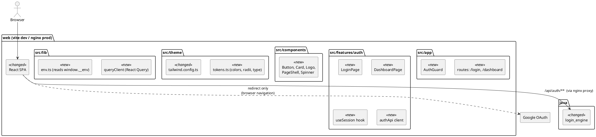
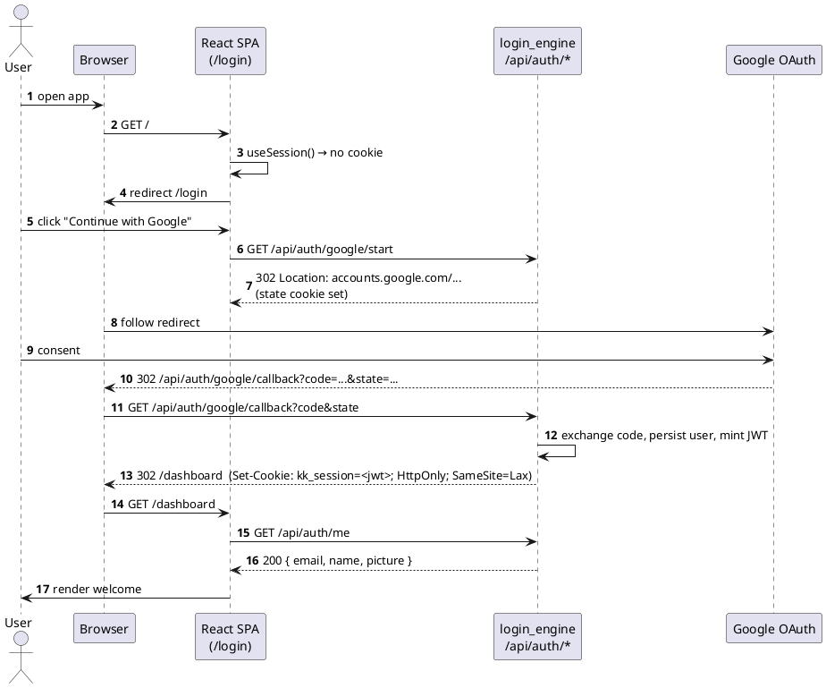
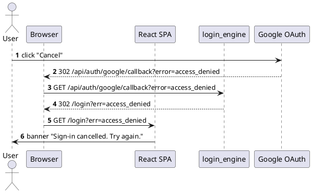

# Spec: User login — Web UI (Google OAuth flow)

| Field       | Value                                                                          |
|-------------|--------------------------------------------------------------------------------|
| Feature     | Two-page Google-login SPA (login → welcome/dashboard) wired to `login_engine`  |
| Engine(s)   | `web`                                                                          |
| Owner       | tb                                                                             |
| Status      | draft                                                                          |
| Date        | 2026-07-25                                                                     |
| jlog day    | Day 2 (`resources/jlog/app_development_log.md`)                                |
| Related     | Design brief `resources/design/user_login/user_login_index.md`; sibling spec `2026-07-25-user-login-engine.md` |

## 1. Motivation

App has no entry point today — nothing to hit and no way to obtain the Gmail
tokens the ingestion/stager engines will need. This spec delivers the smallest
usable front door: a modern analytical-themed login screen that hands off to
Google OAuth and lands the user on a welcome/dashboard page proving the session
is live. All later engines (bill scan, expense views) will plug into this shell.

## 2. Scope

| In                                                                     | Out                                                     |
|------------------------------------------------------------------------|---------------------------------------------------------|
| Two routes: `/login`, `/dashboard` with an `AuthGuard`                 | Multi-tenant / organisation switching                   |
| "Continue with Google" button using `@react-oauth/google` code-flow    | Password / email-magic-link auth                        |
| Server-driven callback → JWT-in-httpOnly-cookie session                | Refresh-token rotation UI (backend handles silently)    |
| Analytical theme tokens (colours, typography, spacing) in Tailwind cfg | Full component library — only what these 2 pages need   |
| Reusable primitives: `Button`, `Card`, `Logo`, `PageShell`, `Spinner`  | Dark-mode toggle (theme supports it; toggle deferred)   |
| Skill file `.claude/skills/web-agent/SKILL.md` guiding future work     | Storybook / visual-regression setup                     |
| `npm run dev` locally + docker image behind nginx (already scaffolded) | i18n / RTL                                              |

## 3. Architecture change

Legend: `<<new>>` added by this spec, `<<changed>>` altered, `<<removed>>` deleted.

## 4. Workflows

### 4.1 Happy path — first-time login

### 4.2 Failure path — user denies consent / callback error

## 5. API contracts

Web is a **consumer** of `login_engine` — full request/response is defined in the
sibling engine spec. Table below lists only what the SPA calls and how it maps
to a React Query hook.

### 5.1 SPA → `login_engine` calls

| Call                                     | Trigger                          | React Query hook          | On success                         | On error                                     |
|------------------------------------------|----------------------------------|---------------------------|------------------------------------|----------------------------------------------|
| `GET /api/auth/google/start` (navigate)  | `LoginPage` button click         | none — `window.location`  | browser leaves SPA                 | 5xx → toast "Google is unreachable"          |
| `GET /api/auth/me`                       | `useSession()` on mount / focus  | `useQuery(['session'])`   | populate session, allow `/dashboard` | 401 → clear cache, redirect `/login`       |
| `POST /api/auth/logout`                  | user clicks "Sign out"           | `useMutation`             | invalidate session, redirect `/login` | 5xx → toast "Try again"                  |

### 5.2 Runtime env contract

| Key                | Source                                                     | Used by                    |
|--------------------|------------------------------------------------------------|----------------------------|
| `API_BASE_URL`     | `docker-entrypoint.sh` → `/env.js` → `window.__env`        | `src/lib/env.ts`           |
| `GOOGLE_CLIENT_ID` | same as above (display-only fallback — flow is server-led) | `LoginPage` (branding txt) |

## 6. Database schema

_N/A — web owns no persistent state. Session lives in an httpOnly cookie set by
`login_engine`; the user record is in `khata_users` (see engine spec §6)._

## 7. Exception handling

| Trigger                                   | Type / Error code               | HTTP (observed) | User message                                     | Log level (console) |
|-------------------------------------------|---------------------------------|-----------------|--------------------------------------------------|---------------------|
| `/api/auth/me` returns 401                | `SessionExpired` (client-side)  | 401             | silent → redirect `/login`                       | debug               |
| `/api/auth/me` returns 5xx                | `SessionUnavailable`            | 5xx             | full-page error card "Service unavailable"       | error               |
| Callback URL carries `?err=access_denied` | `LoginCancelled`                | —               | banner "Sign-in cancelled. Try again."           | info                |
| Callback URL carries `?err=state_invalid` | `CsrfMismatch`                  | —               | banner "Session expired mid-login. Try again."   | warn                |
| `POST /api/auth/logout` 5xx               | `LogoutFailed`                  | 5xx             | toast "Couldn't sign out — reload the page."     | error               |
| React Query network error (offline)       | React Query `error` state       | —               | `<PageShell>` renders retry card                 | warn                |

## 8. Deployment strategy

| Aspect               | Detail                                                                                                       |
|----------------------|--------------------------------------------------------------------------------------------------------------|
| Compose service      | `web` (existing, image rebuild)                                                                              |
| Local dev            | `cd web && npm install && npm run dev` → http://localhost:3000. Vite dev server needs `login_engine` reachable at `http://localhost:8082`; add `server.proxy` (see §8.1). |
| Docker build         | `docker compose -f infra/docker-compose.yml up --build web`                                                  |
| Runtime env injected | `API_BASE_URL=/api`, `GOOGLE_CLIENT_ID=<from .env>` via `docker-entrypoint.sh` → `/env.js`                   |
| New env vars         | none (both already declared in compose `web.environment`)                                                    |
| Rollback             | `docker compose up --build web` off previous git sha; SPA cookies remain valid until JWT expiry (24 h)       |
| Feature flag         | not required — replaces the placeholder `App.tsx`                                                            |

### 8.1 `vite.config.ts` diff (local dev proxy)

| Change | Section          | Value                                                                                     |
|--------|------------------|-------------------------------------------------------------------------------------------|
| +      | `server.proxy`   | `{ "/api": { target: "http://localhost:8082", changeOrigin: true } }`                     |

### 8.2 `docker-compose.yml` diff

_None — `web` service already declared with correct env + depends_on._

## 9. Test plan

| Layer            | Scope                                                                    | Tooling                                       |
|------------------|--------------------------------------------------------------------------|-----------------------------------------------|
| Unit             | `useSession` (mocked fetch), `AuthGuard` redirect logic, `env.ts` parse  | Vitest + `@testing-library/react`             |
| Component        | `LoginPage` renders button, disabled during in-flight; `DashboardPage` shows user email | Vitest + `@testing-library/user-event` |
| A11y smoke       | `LoginPage` keyboard-tab reaches button; `aria-live` on error banner     | `@testing-library/jest-dom` matchers          |
| Lint / types     | `npm run lint`, `npm run type-check`                                     | ESLint 9 + TS 5.7                             |
| Manual E2E       | Full compose stack, real Google consent, cookie set, `/dashboard` renders | manual checklist (below)                    |

Manual E2E checklist:
1. `docker compose -f infra/docker-compose.yml up --build`
2. Open http://localhost:3000 → redirected to `/login`.
3. Click "Continue with Google" → Google consent screen appears.
4. Approve → land on `/dashboard`, welcome message shows the correct email.
5. Reload `/dashboard` → still authenticated (cookie survives).
6. Click "Sign out" → back on `/login`, `/dashboard` blocked.
7. Repeat step 3, click "Cancel" → banner "Sign-in cancelled".

## 10. Theme & reusable components (from design brief)

### 10.1 Theme tokens (`src/theme/tokens.ts`, echoed into `tailwind.config.ts`)

| Token group | Key                | Value                                              |
|-------------|--------------------|----------------------------------------------------|
| color       | `bg.canvas`        | `#0B0F14` (dark) / `#F7F8FA` (light)               |
| color       | `bg.surface`       | `#111826` / `#FFFFFF`                              |
| color       | `text.primary`     | `#E6EAF2` / `#0B0F14`                              |
| color       | `text.muted`       | `#94A3B8`                                          |
| color       | `accent.primary`   | `#3B82F6` (analytical blue)                        |
| color       | `accent.success`   | `#10B981`                                          |
| color       | `accent.danger`    | `#EF4444`                                          |
| radius      | `sm / md / lg`     | `4 / 8 / 16` px                                    |
| type        | `font.sans`        | `"Inter", system-ui, sans-serif`                   |
| type        | `font.mono`        | `"JetBrains Mono", ui-monospace, monospace`        |
| spacing     | scale              | Tailwind default (`0.25rem` step)                  |
| shadow      | `card`             | `0 1px 2px rgba(0,0,0,.06), 0 4px 12px rgba(0,0,0,.04)` |

### 10.2 Reusable components (`src/components/`)

| Component     | Props (essential)                                            | Notes                                                       |
|---------------|--------------------------------------------------------------|-------------------------------------------------------------|
| `Button`      | `variant: primary\|secondary\|ghost`, `size`, `loading`, `icon` | `clsx + tailwind-merge`; focus-visible ring                 |
| `Card`        | `title?`, `footer?`, `padding`                               | Uses `bg.surface` + `shadow.card`                           |
| `Logo`        | `size`                                                       | Wordmark "KharchaKhata" in analytical accent                |
| `PageShell`   | `header?`, `footer?`                                         | Sets canvas bg, max-w container, safe-area padding          |
| `Spinner`     | `size`                                                       | `lucide-react` `Loader2` w/ spin animation                  |
| `Banner`      | `tone: info\|warn\|error`, `onClose?`                        | Used for `?err=` messages                                   |

### 10.3 Skill file to author

| Path                                    | Purpose                                                                   |
|-----------------------------------------|---------------------------------------------------------------------------|
| `.claude/skills/web-agent/SKILL.md`     | Trigger `/web-agent`. Guides future agents on: theme tokens, component reuse rules, folder conventions (`app/`, `features/`, `components/`, `lib/`), Tailwind class order, React Query patterns, test setup. |

## 11. Open questions

| # | Question                                                                            | Proposed answer / recommendation                                                                                          | Owner | Decision by |
|---|-------------------------------------------------------------------------------------|---------------------------------------------------------------------------------------------------------------------------|-------|-------------|
| 1 | Do we use `@react-oauth/google` client-side popup, or fully server-led redirect?    | **Server-led redirect** — matches design sequence diagram, keeps client_secret + refresh_token flow on backend, no client-side token handling. Drop `@react-oauth/google` dep unless needed for a button component only. | tb | 2026-07-30 |
| 2 | Session storage: httpOnly cookie or `Authorization` header from `localStorage`?     | **httpOnly `SameSite=Lax` cookie** — protects against XSS token theft; SPA and API share origin via nginx so no CORS pain. | tb | 2026-07-30 |
| 3 | Where does the SPA read `GOOGLE_CLIENT_ID` from — build-time or runtime?            | **Runtime** via `/env.js` (pattern already in place). Lets us ship one image across envs.                                | tb | 2026-07-28 |
| 4 | Dashboard content on Day-1: welcome only, or stub cards for future engines?         | **Welcome only** — avoid dead UI. Add a single "Connect Gmail" CTA card that no-ops for now.                             | tb | 2026-07-30 |
| 5 | Do we ship dark-mode from Day-1?                                                    | **Tokens support both, ship light default, no toggle** — reduces surface area; toggle in later spec.                     | tb | 2026-07-28 |
| 6 | React Router v7 file-router vs. code router?                                        | **Code router** — 2 routes, adding file-router structure now is premature.                                                | tb | 2026-07-28 |
| 7 | Do we need a CSRF token on `POST /api/auth/logout`?                                 | **Yes** — `SameSite=Lax` doesn't cover POST from cross-site forms cleanly. Reuse the `state` cookie pattern or add `X-CSRF` header. Confirm with engine spec §7. | tb | 2026-08-05 |
| 8 | Backend naming (referenced in URLs / diagrams): `login_engine` vs. folded into `user_engine`?                    | **`login_engine`** (decided, sibling engine spec Q #1). Login + token lifecycle isolated in its own service; future `user_engine` handles profile/workflows. URL paths (`/api/auth/**`) unchanged — nginx proxies to `login_engine:8082`. | tb (decided) | 2026-07-25 |
